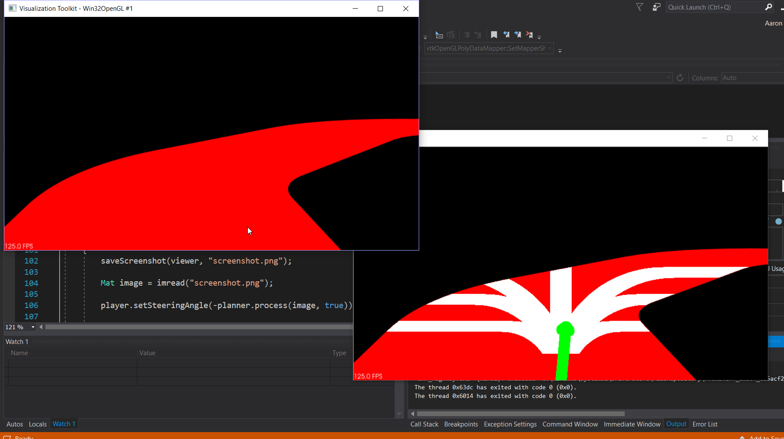

# Segmentation-Driver

Simulator for creating a semantic segmented track and then using computer vision to try and drive around it.

During the self-driving race car event at Thunderhill 2019 event, our team "Team Souless" went with a semantic segmentation approach for perception and then 
used computer vision for trajectory planning. The semantic segmentation results actually turned out quite well and the challenging part was to
get the car to drive around the course using the segmented road red pixel images. The computer vision approach that we tried out was pretty simple
and involved counting road pixels within trajectory outlines, and this was used to calculate the steering wheel angle for the car. Testing the
code on the track each time was difficult given we only had a short amount of time on the track during each test. Also the algorithm required alot
of fine tuning to get the turning parameters just right. During the end of the event the car was able to make it around some of the Thunderhill
track turns but not all of them, and not all in one full lap. To fine tune the trajectory planning algorithm it would be great to have a simulator
that was flexiable and could make it much easier to test on. Now here is that simulator which can create a virtual test track and take images from 
the first person perspective to feed to the same image planning pipeline that our team used in the race.

For the repo with all the code used in the race check out, https://github.com/ranakhalil/Soulless2019.
In particular the code used for planning was located in `src/trajectory_node/src`.

## Using the Simulator
Dependencies for building the simulator are PCL and OpenCV

The simulator can be built by using the CMakeLists.txt file, in which case you could follow these commands.
1. Clone the repo
2. Go into the root directory of the repo
3. mkdir build
4. cd build
5. cmake ..
6. make
7. move seg_driver.exe to root, OR ( change code in environment.cpp to change path were image is loaded to "build/screenshot.png")
7. ./seg_driver

Note: on ubuntu 16 there was some issues saving png images, they were rendered as only black. Not sure if this is experienced with other users
and will need to investigate more. The program was not having issues creating images on windows using VS.

For Windows users using Virutal Studio you can install PCL and OpenCV through vcpkg manager and run the project from inside VS.

